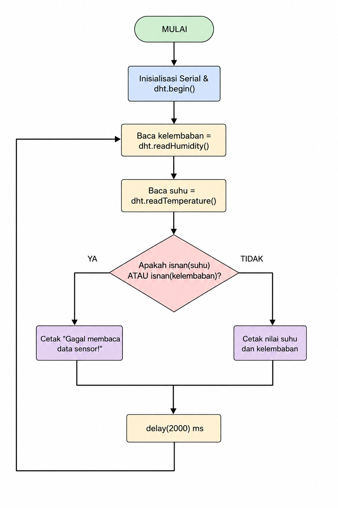
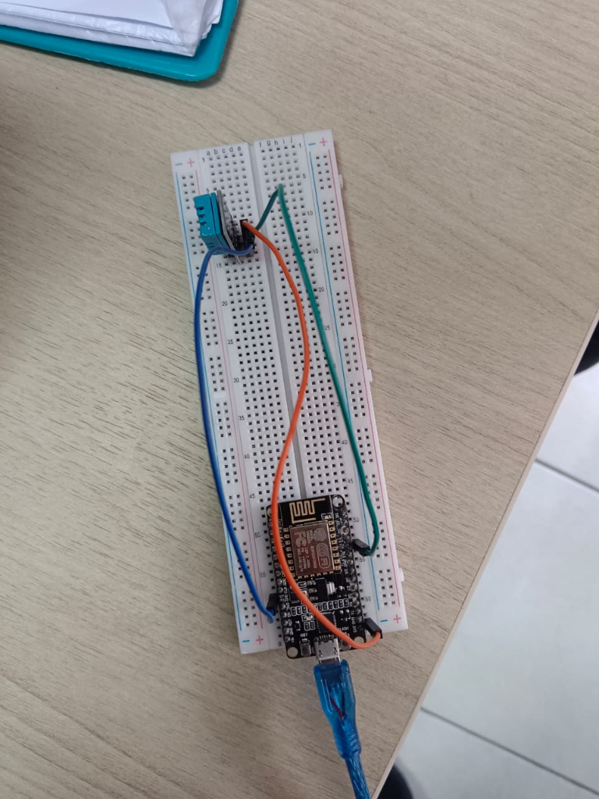
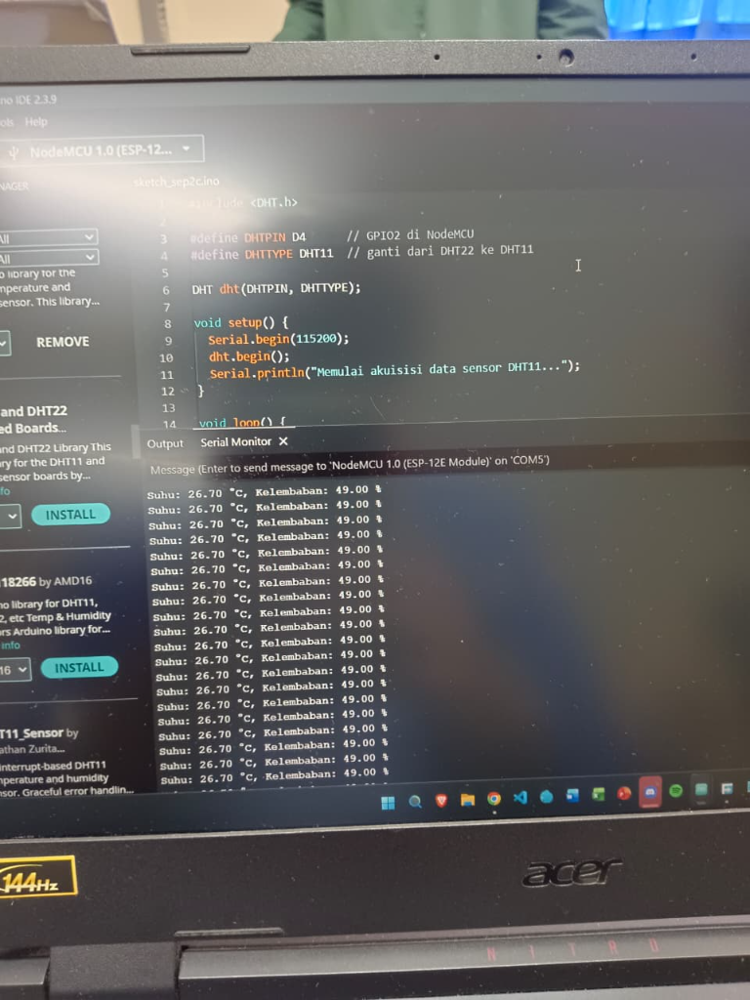
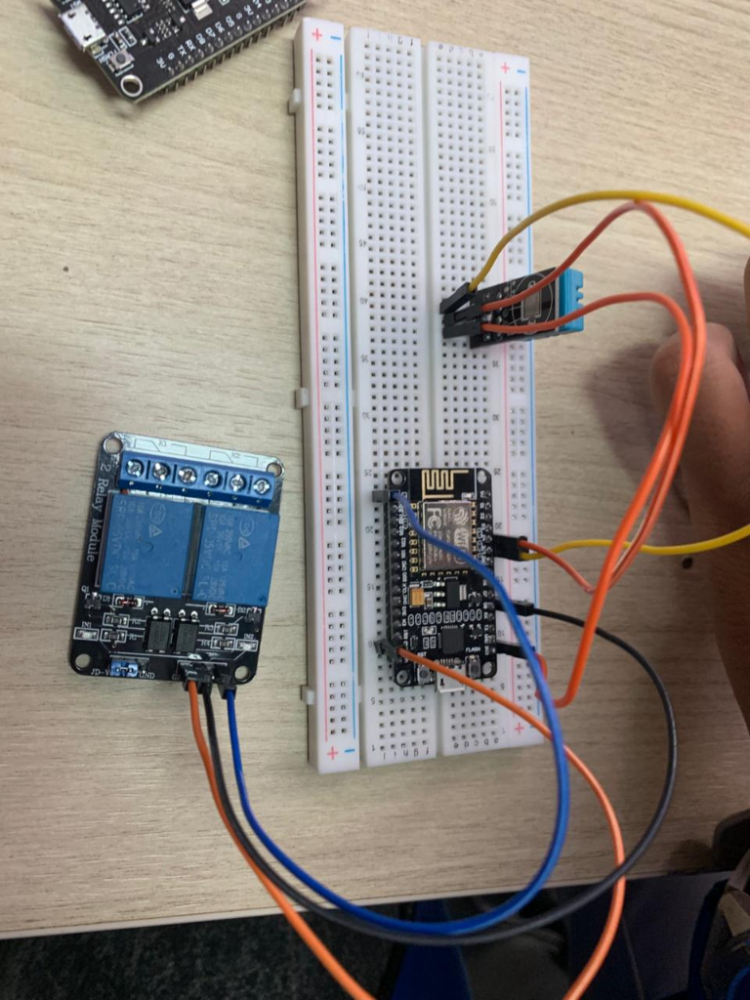

# Pertemuan 1 - Sensor dan Aktuator
## Penjelasan Code

### Percobaan 1

Kode ada di [code/Percobaan1H1.ino](code/Percobaan1H1.ino). Percobaan ini menggunakan NodeMCU ESP8266 dan DHT11. Pin data sensor dipasang pada `D4` atau GPIO2. Setiap perulangan program membaca suhu dan kelembaban, lalu menampilkannya di Serial Monitor

Kalau sensor gagal dibaca, program menampilkan pesan kesalahan. Kalau pembacaan berhasil, nilai suhu dan kelembaban ditampilkan. Pembacaan dilakukan setiap 500 ms

### Percobaan 2

Kode ada di [code/Percobaan2H1.ino](code/Percobaan2H1.ino). Percobaan ini menggunakan NodeMCU ESP8266, DHT11 pada D4, dan relay atau LED pada D1. Suhu yang terbaca dibandingkan dengan batas `30.0 C`

Jika suhu lebih dari 30.0 C, relay atau LED dinyalakan. Jika suhu 30.0 C atau lebih rendah, relay atau LED dimatikan

## Penjelasan Setiap Fungsi

- `setup()` dijalankan satu kali ketika board mulai menyala. Fungsi ini menyiapkan Serial Monitor, sensor DHT, dan pin relay
- `loop()` dijalankan terus-menerus untuk membaca sensor dan menjalankan program
- `dht.begin()` memulai sensor DHT
- `dht.readTemperature()` membaca suhu
- `dht.readHumidity()` membaca kelembaban
- `isnan()` mengecek apakah hasil pembacaan sensor tidak valid
- `pinMode()` mengatur fungsi sebuah pin, misalnya sebagai `OUTPUT`
- `digitalWrite()` memberi keluaran `HIGH` atau `LOW` pada pin relay
- `Serial.print()` dan `Serial.println()` menampilkan informasi di Serial Monitor
- `delay()` memberi jeda sebelum proses berikutnya

## Penjelasan Percabangan atau Conditional

Pada Percobaan 1, kondisi `isnan(kelembaban) || isnan(suhu)` mengecek hasil pembacaan sensor. Jika salah satu hasil tidak valid, program menampilkan pesan kegagalan. Jika keduanya valid, nilai suhu dan kelembaban ditampilkan

Pada Percobaan 2, program mengecek apakah pembacaan suhu gagal. Jika berhasil, suhu dibandingkan dengan `suhuThreshold` menggunakan kondisi `suhu > suhuThreshold`. Relay menyala jika suhu lebih dari 30.0 C dan mati jika suhu kurang dari atau sama dengan 30.0 C

## Library atau Dependencies yang Diperlukan

- Arduino IDE
- Library `DHT sensor library`
- NodeMCU ESP8266
- Sensor DHT11
- Relay atau LED

Library DHT dipanggil dengan perintah `#include <DHT.h>`

## Jawaban Pertanyaan Praktikum yang Berkaitan dengan Code

### Percobaan 1

#### 1. Diagram Alur

Berikut diagram alur proses akuisisi data sensor DHT11:



#### 2. Fungsi `isnan()`

`isnan()` digunakan untuk mengecek apakah nilai suhu atau kelembaban bukan angka. Pada kode, kondisi `!isnan(suhu) && !isnan(kelembaban)` berarti data hanya dihitung jika kedua hasil pembacaan valid. Data yang gagal tidak dimasukkan ke total

#### 3. Alasan Menggunakan `delay(2000)`

Sensor DHT11 tidak dapat dibaca terus-menerus dalam waktu yang sangat singkat. Jeda sekitar 2 detik memberi waktu bagi sensor untuk menyelesaikan pengukuran dan menyiapkan data berikutnya. Tanpa jeda yang cukup, pembacaan bisa gagal atau hasilnya tidak stabil

#### 4. Modifikasi Rata-rata Lima Pembacaan

Berikut bagian program yang sudah dimodifikasi untuk mengambil lima pembacaan sebelum menampilkan hasil:

```cpp
float totalSuhu = 0;             // Menyimpan jumlah seluruh suhu yang valid.
float totalKelembaban = 0;      // Menyimpan jumlah seluruh kelembaban yang valid.
int pembacaanValid = 0;         // Menghitung jumlah pembacaan yang berhasil.

for (int i = 0; i < 5; i++) {   // Mengulang proses pembacaan sebanyak lima kali.
	float suhu = dht.readTemperature();
	float kelembaban = dht.readHumidity();

	if (!isnan(suhu) && !isnan(kelembaban)) { // Hanya menerima data yang valid.
		totalSuhu += suhu;                     // Menambahkan suhu ke total.
		totalKelembaban += kelembaban;         // Menambahkan kelembaban ke total.
		pembacaanValid++;                      // Menambah jumlah data valid.
	}
	delay(2000);                             // Menunggu sebelum membaca sensor lagi.
}

if (pembacaanValid > 0) {                  // Memastikan ada data yang bisa dihitung.
	float rataSuhu = totalSuhu / pembacaanValid;
	float rataKelembaban = totalKelembaban / pembacaanValid;
	Serial.print("Rata-rata Suhu: ");
	Serial.print(rataSuhu);
	Serial.print(" C, Rata-rata Kelembaban: ");
	Serial.print(rataKelembaban);
	Serial.println(" %");
} else {
	Serial.println("Gagal membaca data sensor!");
}
```

`totalSuhu` dan `totalKelembaban` dipakai untuk menjumlahkan data. `pembacaanValid` dipakai sebagai pembagi agar data yang gagal tidak ikut memengaruhi rata-rata. Perulangan `for` menjalankan lima kali pembacaan, lalu hasilnya dibagi dengan jumlah pembacaan yang berhasil

### Percobaan 2

#### 1. Fungsi Nilai Threshold

Threshold adalah nilai pembanding untuk menentukan kapan aktuator bekerja. Pada program awal, `suhuThreshold` menjadi batas antara kondisi `ON` dan `OFF`. Dengan threshold, sensor tidak hanya menampilkan data, tetapi juga dapat dipakai untuk mengambil keputusan kendali

#### 2. Jika `suhuThreshold` Diturunkan Menjadi 20.0

Aktuator akan lebih sering menyala karena suhu ruangan biasanya lebih tinggi dari 20.0 C. Aktuator hanya mati ketika suhu berada pada atau di bawah 20.0 C. Jadi, semakin rendah threshold, semakin mudah kondisi `suhu > suhuThreshold` terpenuhi

#### 3. Perbedaan Kendali Tunggal dan Histerisis

Pada kendali dengan satu threshold, aktuator langsung berubah keadaan ketika suhu melewati satu batas. Jika suhu berada di sekitar batas tersebut, aktuator dapat sering hidup dan mati karena perubahan suhu kecil

Pada kendali histerisis, digunakan dua batas. Aktuator menyala saat suhu melewati batas atas, yaitu 30 C, dan baru mati saat suhu turun melewati batas bawah, yaitu 28 C. Jarak antara dua batas ini membantu mencegah aktuator terlalu sering berganti keadaan

#### 4. Modifikasi Program dengan Histerisis

Berikut bagian program yang menggunakan dua threshold:

```cpp
const float suhuON = 30.0;       // Aktuator menyala jika suhu lebih dari 30 C.
const float suhuOFF = 28.0;      // Aktuator mati jika suhu kurang dari 28 C.
bool aktuatorON = false;         // Menyimpan keadaan aktuator sebelumnya.

float suhu = dht.readTemperature();

if (isnan(suhu)) {
	Serial.println("Gagal membaca data sensor!");
} else {
	if (suhu > suhuON) {           // Batas atas terlewati, aktuator dinyalakan.
		aktuatorON = true;
	} else if (suhu < suhuOFF) {   // Batas bawah terlewati, aktuator dimatikan.
		aktuatorON = false;
	}

	digitalWrite(RELAYPIN, aktuatorON ? HIGH : LOW); // Terapkan keadaan aktuator.

	if (aktuatorON) {
		Serial.println("Aktuator: ON");
	} else {
		Serial.println("Aktuator: OFF");
	}
}
	delay(2000);                     // Memberi jeda antar pembacaan DHT11.
```

Variabel `aktuatorON` menyimpan keadaan terakhir. Saat suhu berada di antara 28 C dan 30 C, tidak ada kondisi yang mengubah variabel tersebut, sehingga aktuator mempertahankan keadaan sebelumnya. Inilah bagian yang membuat program bekerja dengan histerisis

## Penjelasan Singkat Detail Percobaan

Pada Percobaan 1, DHT11 dipasang ke NodeMCU. Setelah program di-upload, suhu dan kelembaban dapat dilihat melalui Serial Monitor dengan baud rate `115200`

Pada Percobaan 2, DHT11 dipasang ke NodeMCU ESP8266 dan relay atau LED dipasang sebagai aktuator. Nilai suhu digunakan untuk menentukan apakah aktuator menyala atau mati

## Skematik atau Diagram Rangkaian

### Percobaan 1: NodeMCU dan DHT11

```text
NodeMCU ESP8266       DHT11
3V3 ------------------ VCC
GND ------------------ GND
D4 / GPIO2 ----------- DATA
```

### Percobaan 2: ESP8266, DHT11, dan Relay atau LED

```text
NodeMCU ESP8266       DHT11
3V3 ------------------ VCC
GND ------------------ GND
D4 ------------------- DATA

NodeMCU ESP8266       Relay / LED
GND ------------------ GND
D1 ------------------- IN / Anode melalui resistor
```

Diagram ini mengikuti pin yang digunakan di dalam program. Sambungan daya dan modul relay perlu disesuaikan dengan komponen yang dipakai saat praktikum

## Foto Proses Praktikum atau Perangkaian

### Percobaan 1





### Percobaan 2

