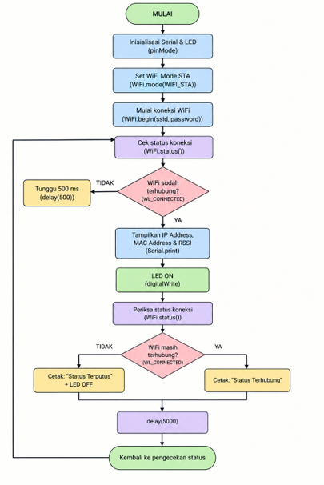
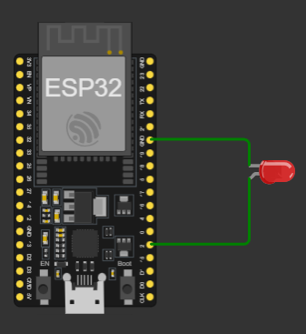
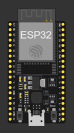
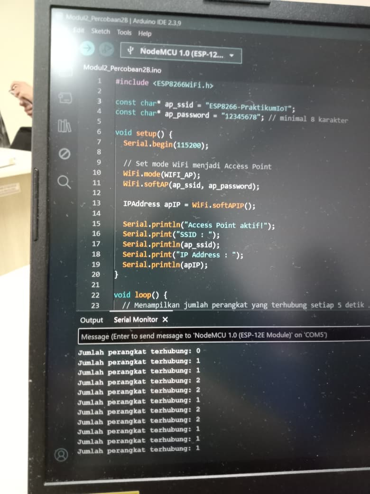
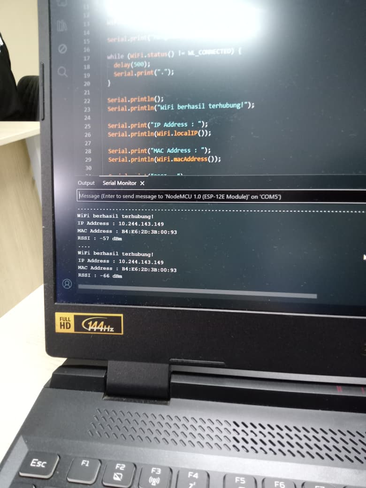
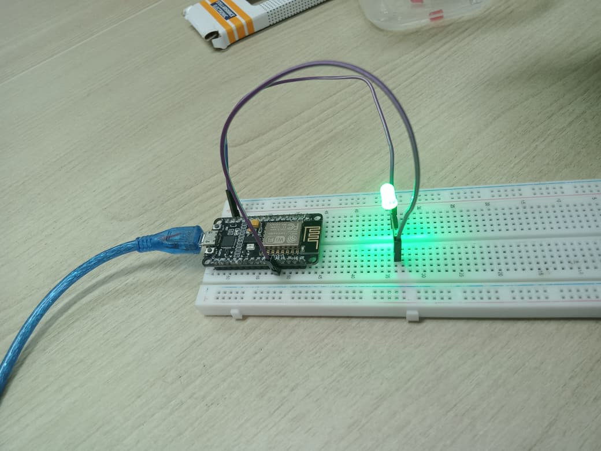
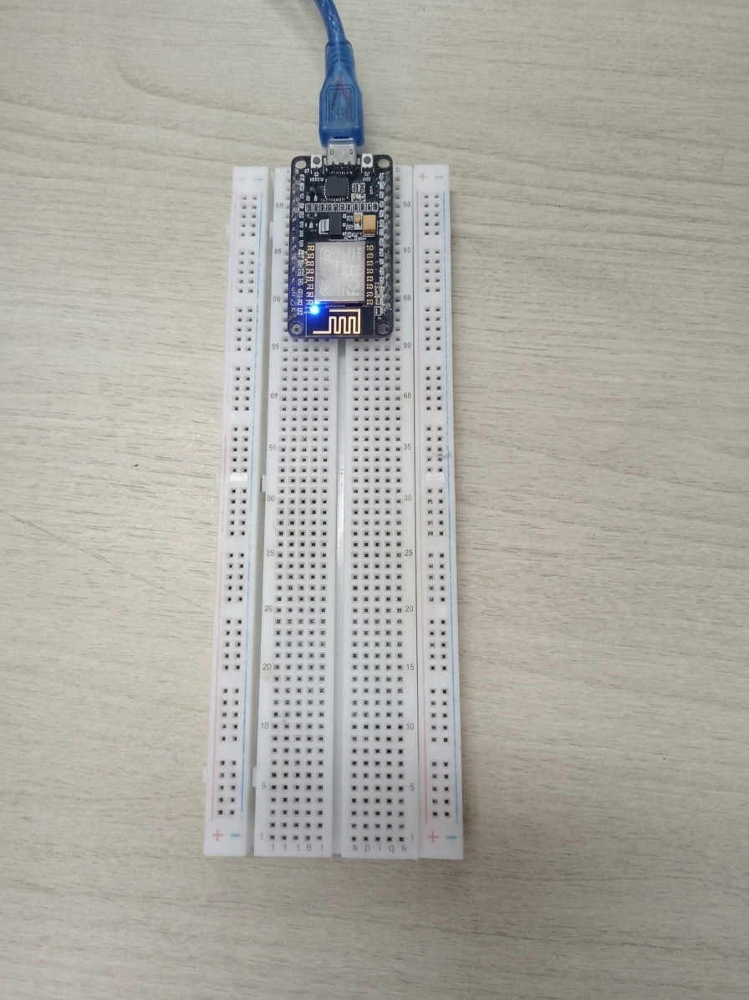

# Pertemuan 2 - Konfigurasi Jaringan

## Penjelasan Code

### Percobaan 2A - Station

Program Percobaan 2A dapat dilihat di [code/Percobaan2A_STA.ino](code/Percobaan2A_STA.ino). ESP8266 dihubungkan ke jaringan `vivo` sebagai Station. Setelah terhubung, program menampilkan IP address, MAC address, dan RSSI. LED pada GPIO2 menyala sebagai tanda koneksi berhasil.

Fungsi `connectToWiFi()` digunakan saat board pertama kali menyala dan saat koneksi terputus. Program menunggu paling lama 20 detik agar tidak berhenti terus-menerus jika SSID atau password salah. Status WiFi diperiksa setiap 5 detik.

### Percobaan 2B - Access Point

Program Percobaan 2B dapat dilihat di [code/Percobaan2B_AP.ino](code/Percobaan2B_AP.ino). ESP8266 membuat jaringan WiFi sendiri dengan SSID `ESP8266-PraktikumIoT` dan password `12345678`. Program menampilkan IP AP dan jumlah perangkat yang terhubung setiap 5 detik.

## Penjelasan Setiap Fungsi

- `setup()` dijalankan sekali untuk memulai Serial Monitor dan konfigurasi WiFi.
- `loop()` berjalan berulang untuk memantau koneksi dan jumlah client.
- `WiFi.mode()` memilih peran WiFi, yaitu `WIFI_STA`, `WIFI_AP`, atau `WIFI_AP_STA`.
- `WiFi.begin()` memulai koneksi ESP8266 ke jaringan yang sudah tersedia.
- `WiFi.status()` membaca status koneksi dan dibandingkan dengan `WL_CONNECTED`.
- `WiFi.localIP()` mengambil IP ESP8266 pada jaringan Station.
- `WiFi.softAP()` membuat Access Point dengan SSID dan password tertentu.
- `WiFi.softAPIP()` mengambil IP Access Point.
- `WiFi.softAPgetStationNum()` membaca jumlah perangkat yang terhubung ke AP.
- `WiFi.RSSI()` membaca kekuatan sinyal dalam dBm; nilai yang lebih dekat ke nol biasanya berarti sinyal lebih kuat.
- `WiFi.macAddress()` mengambil alamat MAC perangkat.
- `millis()` dan `delay()` dipakai untuk mengatur batas waktu serta interval pemeriksaan.
- `pinMode()` dan `digitalWrite()` mengatur LED indikator pada GPIO2.

## Penjelasan Percabangan atau Conditional

Pada mode STA, `WiFi.status() != WL_CONNECTED` digunakan untuk mengecek apakah ESP8266 belum terhubung atau koneksinya terputus. Jika koneksi gagal selama 20 detik, `connectToWiFi()` mengembalikan nilai `false`.

Pada mode AP, hasil dari `WiFi.softAP()` digunakan untuk mengecek apakah Access Point berhasil dibuat. Pada mode AP+STA, jika koneksi Station terputus, hanya koneksi Station yang dicoba kembali. Access Point tetap berjalan.

## Library atau Dependencies yang Diperlukan

- Arduino IDE dengan board manager ESP8266
- Board package ESP8266 untuk Arduino IDE
- Library bawaan board: `ESP8266WiFi.h`
- NodeMCU ESP8266
- Kabel USB
- Jaringan WiFi atau hotspot untuk pengujian STA
- Smartphone atau laptop untuk menguji Access Point
- LED bawaan atau LED eksternal pada GPIO2 dengan resistor 220 Ohm

Library WiFi dipanggil dengan perintah `#include <ESP8266WiFi.h>`.

## Jawaban Pertanyaan Praktikum yang Berkaitan dengan Code

### Percobaan 2A

#### 1. Diagram Alur

Berikut foto diagram alur koneksi ESP8266 ke WiFi pada percobaan 2A:



Program memulai Serial dan LED, memilih mode STA, lalu memanggil `WiFi.begin()`. Status diperiksa sampai terhubung atau batas 20 detik tercapai. Jika berhasil, IP, MAC, dan RSSI ditampilkan serta LED dinyalakan. Setelah itu `loop()` memeriksa koneksi setiap 5 detik dan memulai reconnect ketika koneksi terputus.

#### 2. Fungsi `WiFi.mode(WIFI_STA)`

Perintah tersebut menetapkan ESP8266 sebagai Station atau client. ESP8266 kemudian dapat bergabung ke router atau hotspot yang sudah tersedia menggunakan SSID dan password melalui `WiFi.begin()`.

#### 3. Jika SSID atau password salah

ESP8266 tidak akan mencapai `WL_CONNECTED`. Jika SSID salah, jaringan tujuan tidak ditemukan. Jika password salah, proses autentikasi gagal. Akibatnya board tidak memperoleh IP dari router dan LED tetap mati. Pada kode ini, percobaan tersebut tidak membuat program macet selamanya karena dibatasi 20 detik dan akan dicoba kembali pada pemeriksaan berikutnya.

#### 4. Reconnect otomatis

Reconnect dilakukan pada bagian `loop()` ketika `WiFi.status()` bukan `WL_CONNECTED`. Program menyalakan LED mati, memanggil `WiFi.disconnect()`, lalu menjalankan `WiFi.begin(ssid, password)` lagi sampai `WL_CONNECTED` tercapai. Setelah itu, program menampilkan IP address kembali dan LED dinyalakan lagi.

#### 4. Modifikasi Reconnect Otomatis

Bagian berikut adalah modifikasi untuk Percobaan 2A agar ESP8266 otomatis mencoba kembali saat koneksi WiFi terputus. Program ini dibuat pada sketch `Modul2_Percobaan2AModif.ino`.

```cpp
#include <ESP8266WiFi.h>                  // Mengaktifkan library WiFi untuk ESP8266

const char* ssid = "myminetae";         // Nama jaringan WiFi yang akan dihubungkan
const char* password = "";               // Password WiFi (kosong jika jaringan terbuka)

const int ledPin = 2;                    // Pin GPIO2 dipakai sebagai indikator koneksi

void setup() {
  Serial.begin(115200);                  // Memulai komunikasi Serial monitor pada baud 115200

  pinMode(ledPin, OUTPUT);               // Mengatur pin LED sebagai output
  digitalWrite(ledPin, LOW);             // Menyalakan LED dalam keadaan awal mati

  WiFi.mode(WIFI_STA);                   // Mengaktifkan mode station agar ESP8266 terhubung ke jaringan
  WiFi.begin(ssid, password);            // Memulai proses koneksi ke WiFi

  Serial.print("Menghubungkan ke WiFi");

  while (WiFi.status() != WL_CONNECTED) { // Menunggu sampai koneksi berhasil
    delay(500);                          // Jeda 500 ms untuk mencoba kembali
    Serial.print(".");
  }

  Serial.println();
  Serial.println("WiFi berhasil terhubung!");

  Serial.print("IP Address : ");
  Serial.println(WiFi.localIP());         // Menampilkan alamat IP lokal setelah terhubung

  Serial.print("MAC Address : ");
  Serial.println(WiFi.macAddress());      // Menampilkan alamat MAC ESP8266

  Serial.print("RSSI : ");
  Serial.print(WiFi.RSSI());              // Membaca kekuatan sinyal WiFi
  Serial.println(" dBm");

  digitalWrite(ledPin, HIGH);             // LED menyala saat koneksi berhasil
}

void loop() {
  if (WiFi.status() != WL_CONNECTED) {    // Jika koneksi terputus, jalankan reconnect
    Serial.println("WiFi terputus!");
    Serial.println("Mencoba menghubungkan kembali...");

    digitalWrite(ledPin, LOW);            // LED mati saat proses reconnect

    WiFi.disconnect();                    // Memutus koneksi lama
    WiFi.begin(ssid, password);           // Memulai koneksi ulang

    while (WiFi.status() != WL_CONNECTED) { // Menunggu koneksi ulang selesai
      delay(500);
      Serial.print(".");
    }

    Serial.println();
    Serial.println("WiFi berhasil terhubung kembali!");

    Serial.print("IP Address : ");
    Serial.println(WiFi.localIP());

    digitalWrite(ledPin, HIGH);           // LED menyala kembali setelah koneksi berhasil
  }

  delay(1000);                            // Jeda satu detik sebelum pengecekan berikutnya
}
```

### Percobaan 2B

#### 1. Alasan IP AP biasanya `192.168.4.1`

Library ESP8266 menetapkan subnet privat default untuk Access Point. ESP8266 menjadi gateway pada alamat `192.168.4.1`, sedangkan client yang bergabung memperoleh alamat lain pada subnet yang sama. Nilai aktual dapat diubah dengan konfigurasi IP AP, tetapi program ini memakai nilai default melalui `WiFi.softAPIP()`.

#### 2. Perbedaan STA dan AP

STA adalah peran client: ESP8266 bergabung ke jaringan milik router atau hotspot dan memperoleh IP dari jaringan tersebut. AP adalah peran penyedia jaringan: ESP8266 membuat SSID sendiri dan client bergabung langsung ke ESP8266.

#### 3. Risiko password kosong atau sederhana

Perangkat yang tidak berwenang dapat bergabung, memakai bandwidth, mengakses layanan lokal, atau mengirim data ke perangkat IoT. Password yang mudah ditebak juga memudahkan penyalahgunaan. Untuk penggunaan nyata, gunakan password unik yang lebih kuat dan batasi layanan yang tersedia pada AP.

#### 4. Modifikasi AP+STA

Berikut adalah modifikasi program untuk menjalankan ESP8266 dalam mode AP+STA. Program ini dibuat pada sketch `Modul2_Percobaan2BModif.ino`.

```cpp
#include <ESP8266WiFi.h>                  // Mengaktifkan library WiFi untuk ESP8266

const char* ssid = "vivo";              // SSID WiFi utama yang akan dihubungkan
const char* password = "12345678";       // Password WiFi utama

const char* ap_ssid = "ESP8266-PraktikumIoT"; // Nama jaringan yang akan dibuat oleh ESP8266
const char* ap_password = "12345678";          // Password AP yang dibuat oleh ESP8266

void setup() {
  Serial.begin(115200);                  // Mengaktifkan Serial Monitor pada baud 115200

  WiFi.mode(WIFI_AP_STA);                // Mengaktifkan mode AP + STA secara bersamaan

  WiFi.begin(ssid, password);            // Menghubungkan ESP8266 ke WiFi utama

  Serial.print("Menghubungkan ke WiFi");
  while (WiFi.status() != WL_CONNECTED) { // Menunggu koneksi ke WiFi utama berhasil
    delay(500);
    Serial.print(".");
  }

  Serial.println();
  Serial.println("WiFi berhasil terhubung!");
  Serial.print("IP Station : ");
  Serial.println(WiFi.localIP());         // Menampilkan IP dari jaringan utama

  WiFi.softAP(ap_ssid, ap_password);      // Membuat Access Point dengan SSID dan password tertentu

  IPAddress apIP = WiFi.softAPIP();       // Mengambil IP AP yang dibuat oleh ESP8266

  Serial.println("Access Point aktif!");
  Serial.print("SSID : ");
  Serial.println(ap_ssid);                // Menampilkan nama SSID AP
  Serial.print("IP Access Point : ");
  Serial.println(apIP);                   // Menampilkan IP Access Point
}

void loop() {
  int jumlahClient = WiFi.softAPgetStationNum(); // Mengambil jumlah perangkat yang terhubung ke AP

  Serial.print("Jumlah perangkat terhubung: ");
  Serial.println(jumlahClient);                // Menampilkan jumlah client yang terhubung

  delay(5000);                                 // Menunggu 5 detik sebelum mengecek lagi
}
```

`WIFI_AP_STA` membuat ESP8266 terhubung ke WiFi utama sekaligus menyediakan jaringan sendiri. `WiFi.localIP()` menampilkan IP dari jaringan utama, sedangkan `WiFi.softAPIP()` menampilkan IP Access Point. Jumlah perangkat yang terhubung dibaca dengan `WiFi.softAPgetStationNum()`.

## Penjelasan Singkat Detail Percobaan

Serial Monitor digunakan pada baud rate `115200`. Pada pengujian STA, ESP8266 berhasil terhubung dengan SSID `vivo`, memperoleh IP `10.244.143.149` lalu `192.168.172.149`, dan MAC `B4:E6:2D:3B:00:93`. RSSI yang diamati berada sekitar `-61` sampai `-27 dBm` dan LED menyala saat koneksi aktif. Perubahan IP terjadi ketika jaringan atau hotspot yang digunakan berubah.

Pada pengujian kredensial salah, ESP8266 tidak mencapai `WL_CONNECTED`, tidak memperoleh IP dari router, dan program menjalankan percobaan koneksi ulang. Pada pengujian AP, SSID terdeteksi dan IP AP yang digunakan adalah `192.168.4.1`. Jumlah client bertambah bertahap hingga empat smartphone.

Hasil tersebut sesuai dengan spesifikasi: mode STA dapat terhubung dan melaporkan parameter jaringan, sedangkan mode AP dapat ditemukan client dan memantau jumlah perangkat yang terhubung.

## Skematik atau Diagram Rangkaian

### Percobaan 2A



NodeMCU ESP8266 dihubungkan ke LED eksternal pada GPIO2 / D4 dan GND. LED bawaan NodeMCU juga dikendalikan oleh GPIO2. Beberapa board menggunakan LED aktif-LOW, sehingga arah nyala LED dapat berbeda dari LED eksternal.

### Percobaan 2B



ESP8266 cukup dihubungkan ke komputer melalui USB, kemudian smartphone atau laptop mencari SSID Access Point yang dibuat oleh board.

## Foto Proses Praktikum atau Perangkaian

### Percobaan 2A - LED Indikator



LED menyala setelah ESP8266 berhasil terhubung ke jaringan WiFi.



Serial Monitor menampilkan pesan koneksi berhasil, IP address `10.244.143.149`, MAC address `B4:E6:2D:3B:00:93`, dan RSSI.

### Rangkaian ESP8266



Board ESP8266 dipasang pada breadboard dan dihubungkan ke komputer menggunakan kabel USB.

### Percobaan 2B - Access Point



ESP8266 dibuat sebagai Access Point. Board dihubungkan ke komputer melalui USB dan smartphone atau laptop dapat mencari SSID yang dibuat oleh board.


Access Point berhasil dijalankan. Serial Monitor menampilkan perubahan jumlah perangkat yang terhubung