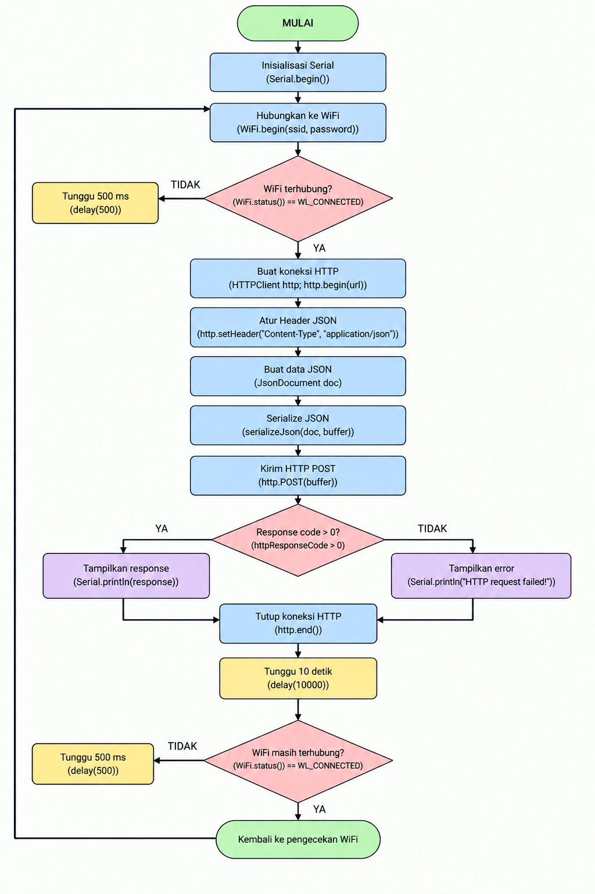
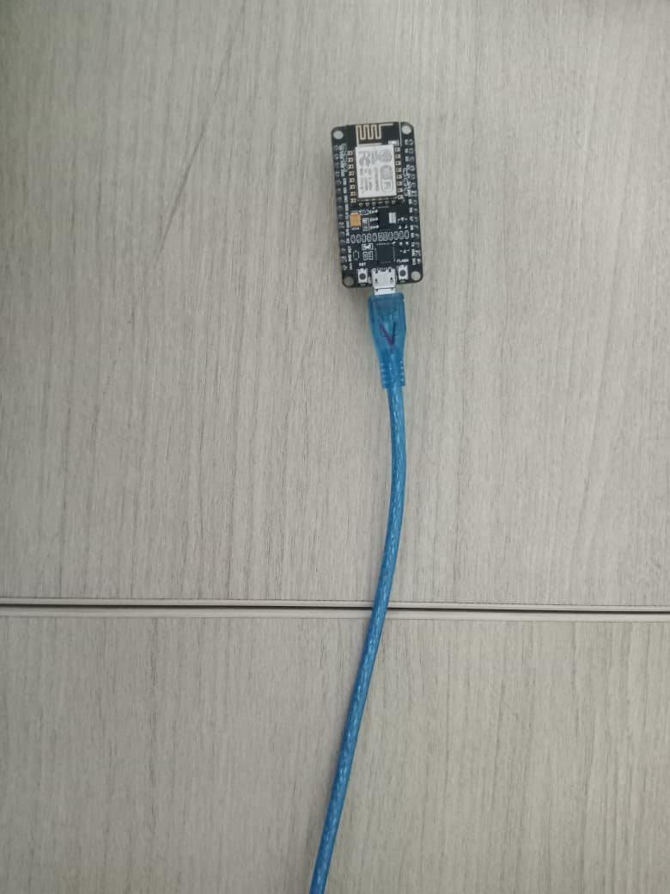
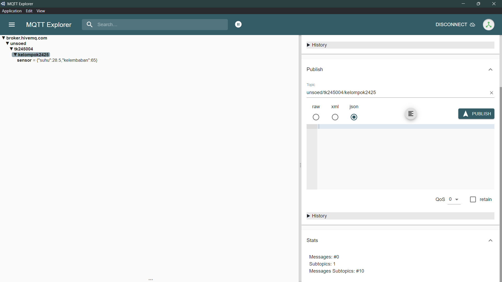
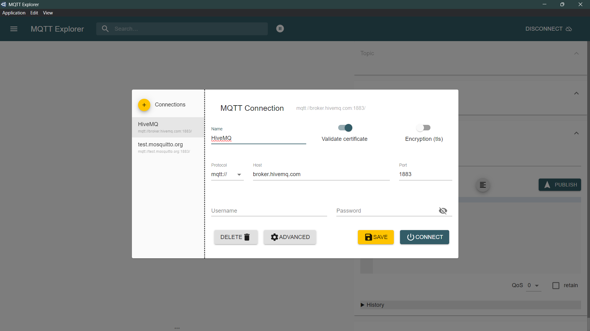
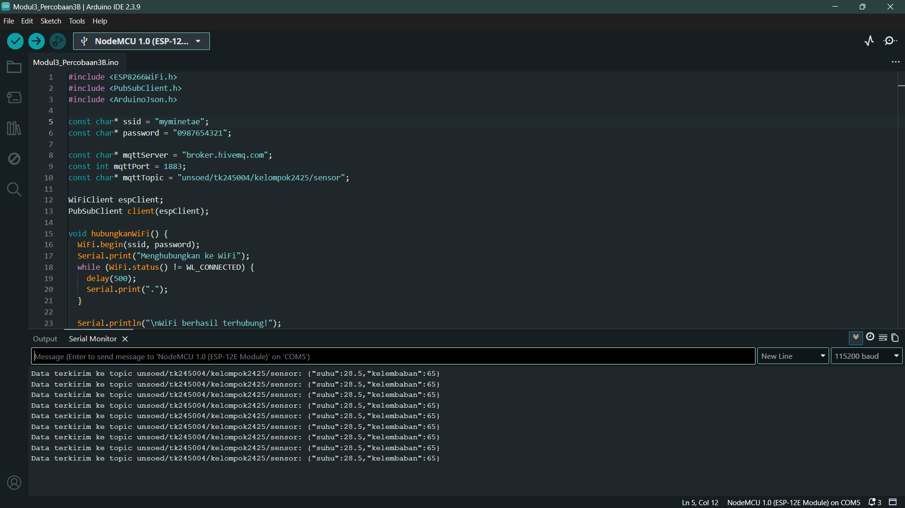

# Pertemuan 3 - Komunikasi Data

## Penjelasan Code

### Percobaan 3A - HTTP POST

Program Percobaan 3A dapat dilihat di [code/Percobaan3A.ino](code/Percobaan3A.ino). ESP8266 terhubung ke jaringan WiFi dan mengirim data sensor dalam format JSON menggunakan metode HTTP POST ke endpoint `https://httpbin.org/post`.

Setelah WiFi berhasil terhubung, board membuat objek `JsonDocument`, kemudian menyiapkan data seperti `suhu` dan `kelembaban`. Hasil serialisasi JSON dikirim ke server dengan `http.POST()`. Respon server ditampilkan di Serial Monitor.

### Percobaan 3B - MQTT Publish

Program Percobaan 3B dapat dilihat di [code/Percobaan3B.ino](code/Percobaan3B.ino). ESP8266 terhubung ke WiFi lalu terhubung ke broker MQTT `broker.hivemq.com` pada port `1883`. Data sensor dikirim ke topic `unsoed/tk245004/kelompok2425/sensor` dalam format JSON.

## Penjelasan Setiap Fungsi

- `setup()` dijalankan sekali saat board dinyalakan. Fungsi ini memulai Serial Monitor, menghubungkan WiFi, dan menyiapkan koneksi MQTT.
- `loop()` berjalan terus-menerus untuk memeriksa status koneksi, menjaga koneksi MQTT tetap aktif, dan mengirim data sensor.
- `WiFi.begin(ssid, password)` digunakan untuk menghubungkan ESP8266 ke jaringan WiFi tertentu.
- `WiFi.status()` mengecek apakah ESP8266 sudah terhubung ke WiFi atau belum.
- `WiFiClientSecure client; client.setInsecure();` dipakai pada pengiriman HTTPS agar koneksi tidak memerlukan validasi sertifikat yang rumit pada tahap praktikum.
- `HTTPClient http;` adalah objek yang menangani permintaan HTTP.
- `http.begin(client, serverUrl)` memulai koneksi ke URL tujuan.
- `http.addHeader("Content-Type", "application/json")` memberi tahu server bahwa data yang dikirim dalam format JSON.
- `JsonDocument doc;` digunakan untuk menyimpan data sensor dalam format JSON.
- `serializeJson(doc, requestBody)` mengubah data JSON menjadi string yang siap dikirim.
- `http.POST(requestBody)` mengirim data dengan metode POST ke server.
- `http.getString()` membaca respon dari server.
- `http.end()` menutup koneksi HTTP setelah proses selesai.
- `PubSubClient client(espClient)` adalah client MQTT yang menggunakan koneksi WiFi.
- `client.setServer(mqttServer, mqttPort)` menentukan alamat dan port broker MQTT.
- `client.connect(clientId.c_str())` membuat koneksi ke broker MQTT.
- `client.publish(mqttTopic, buffer)` mengirimkan pesan ke topik tertentu.
- `client.loop()` memproses aliran data MQTT dan menjaga koneksi tetap aktif.
- `millis()` membaca waktu sejak board dinyalakan, dipakai untuk menambahkan timestamp data.
- `delay()` menunda pengiriman supaya data tidak dikirim terlalu cepat.

## Penjelasan Percabangan atau Conditional

Pada Percobaan 3A, program mengecek `if (WiFi.status() == WL_CONNECTED)` sebelum melakukan pengiriman HTTP. Jika ESP8266 belum terhubung ke WiFi, maka tidak ada request POST yang dikirim. Setelah koneksi berhasil, pengiriman data dilakukan.

Pada Percobaan 3B, kondisi `if (!client.connected())` digunakan untuk memeriksa apakah koneksi MQTT masih aktif. Jika terputus, program memanggil `hubungkanMQTT()` agar ESP8266 mencoba kembali terhubung ke broker. Setelah koneksi berdiri, `client.publish()` dipanggil untuk mengirim data ke topic tertentu.

## Library atau Dependencies yang Diperlukan

- Arduino IDE
- Board package ESP8266 untuk Arduino IDE
- NodeMCU ESP8266
- Library bawaan: `ESP8266WiFi.h`
- Library HTTP: `ESP8266HTTPClient.h`
- Library WiFi client secure: `WiFiClientSecure.h`
- Library JSON: `ArduinoJson.h`
- Library MQTT: `PubSubClient.h`
- Jaringan WiFi dan koneksi internet
- Broker MQTT publik seperti `broker.hivemq.com`
- USB cable dan laptop untuk upload program

Library WiFi dipanggil dengan `#include <ESP8266WiFi.h>`, sedangkan untuk MQTT digunakan `#include <PubSubClient.h>`. Library JSON diperlukan untuk membuat format data `{"suhu": ..., "kelembaban": ...}` sebelum dikirim.

## Jawaban Pertanyaan Praktikum yang Berkaitan dengan Code

### Percobaan 3A

#### 1. Diagram Alur

Berikut diagram alur proses pengiriman data melalui HTTP POST:



Program dimulai dengan membuka Serial Monitor dan menghubungkan ESP8266 ke jaringan WiFi. Setelah koneksi berhasil, ESP8266 membuat data dalam format JSON lalu dikirim ke server menggunakan `http.POST()`. Server memproses permintaan dan mengirimkan response HTTP yang kemudian ditampilkan di Serial Monitor.

#### 2. Fungsi `http.addHeader("Content-Type", "application/json")`

Perintah tersebut digunakan untuk memberitahu server bahwa data yang dikirim memiliki format JSON. Header `Content-Type: application/json` menandakan bahwa request body berisi data JSON, sehingga server dapat membacanya dengan benar dan memproses payload sesuai format yang diterima.

#### 3. Arti kode response HTTP 200 dan contoh kode response lain

Kode `200` berarti request HTTP berhasil diproses oleh server dan hasilnya dikembalikan dengan status sukses. Contoh kode lain adalah `400 Bad Request`, yang berarti request yang dikirim tidak valid atau tidak dapat diproses oleh server. Selain itu, pada ESP8266, kode `-1` biasanya menunjukkan kegagalan koneksi atau komunikasi sehingga tidak ada response HTTP yang valid diterima.

#### 4. Modifikasi program agar data tambahan waktu dikirim dalam JSON

Berikut adalah modifikasi program pada Percobaan 3A agar data yang dikirim memiliki field `waktu` yang berisi lamanya ESP8266 hidup sejak dinyalakan, menggunakan `millis()`.

```cpp
#include <ESP8266WiFi.h>
#include <ESP8266HTTPClient.h>
#include <WiFiClientSecure.h>
#include <ArduinoJson.h>

const char* ssid = "myminetae";
const char* password = "0987654321";
const char* serverUrl = "https://httpbin.org/post";

void setup() {
  Serial.begin(115200);                       // Mengaktifkan komunikasi Serial Monitor
  WiFi.begin(ssid, password);                 // Menghubungkan ESP8266 ke WiFi

  Serial.print("Menghubungkan ke WiFi");
  while (WiFi.status() != WL_CONNECTED) {     // Menunggu sampai WiFi terhubung
    delay(500);
    Serial.print(".");
  }

  Serial.println();
  Serial.println("WiFi berhasil terhubung!");
}

void loop() {
  if (WiFi.status() == WL_CONNECTED) {        // Mengecek apakah ESP8266 sudah terhubung WiFi
    WiFiClientSecure client;                  // Membuat objek client HTTPS
    client.setInsecure();                     // Mengabaikan validasi sertifikat untuk praktikum

    HTTPClient http;                          // Membuat objek client HTTP
    http.begin(client, serverUrl);            // Menentukan URL tujuan request
    http.addHeader("Content-Type", "application/json"); // Memberi tahu server format payload JSON

    JsonDocument doc;                         // Membuat objek JSON untuk data sensor
    doc["suhu"] = 28.5;                       // Menyimpan nilai suhu ke JSON
    doc["kelembaban"] = 65.0;                // Menyimpan nilai kelembaban ke JSON
    doc["waktu"] = millis();                 // Menambahkan waktu sejak board dinyalakan dalam ms

    String requestBody;                       // Variabel untuk menampung JSON hasil serialisasi
    serializeJson(doc, requestBody);          // Mengubah JSON menjadi string siap dikirim

    Serial.print("Mengirim data: ");
    Serial.println(requestBody);              // Menampilkan data JSON yang akan dikirim

    int httpResponseCode = http.POST(requestBody); // Mengirim data dengan metode POST

    if (httpResponseCode > 0) {
      Serial.print("Kode Response HTTP: ");
      Serial.println(httpResponseCode);       // Menampilkan kode status dari server
      Serial.println("Isi Response:");
      Serial.println(http.getString());       // Menampilkan body response dari server
    } else {
      Serial.print("Pengiriman gagal, kode error: ");
      Serial.println(httpResponseCode);       // Menampilkan error jika request gagal
    }

    http.end();                               // Menutup koneksi HTTP
  }

  delay(10000);                                // Menunggu 10 detik sebelum mengirim data berikutnya
}
```

Penjelasan singkat dari kode tambahan:

- `doc["waktu"] = millis();` menambahkan informasi waktu pengiriman dalam satuan milidetik sejak ESP8266 dinyalakan.
- `millis()` sangat berguna untuk mencatat kapan data sensor dibuat dan dikirim, sehingga data dapat ditelusuri berdasarkan waktu.
- `serializeJson(doc, requestBody);` mengubah JSON yang berisi `suhu`, `kelembaban`, dan `waktu` menjadi string yang siap dikirim ke server.

### Percobaan 3B

#### 1. Fungsi topic pada MQTT

Topic berfungsi sebagai jalur atau alamat pengiriman data dalam protokol MQTT. Publisher mengirim data ke topic tertentu, sedangkan subscriber bisa menerima data hanya jika mengikuti topic yang sama. Dengan kata lain, topic berperan seperti saluran komunikasi yang membatasi data agar hanya diterima oleh client yang tepat.

Topic perlu dibuat unik agar data dari satu kelompok atau perangkat tidak bercampur dengan data dari perangkat lain. Misalnya, topic `unsoed/tk245004/kelompok2425/sensor` dibuat khusus untuk kelompok tersebut, sehingga data sensor tidak tertukar dengan kelompok lain.

#### 2. Fungsi `client.loop()`

Perintah `client.loop()` dipanggil pada setiap iterasi `loop()` untuk menjaga koneksi MQTT tetap aktif dan menangani komunikasi dengan broker. Fungsi ini memastikan bahwa ESP8266 terus memproses data masuk dan menjaga session MQTT tetap berjalan dengan benar.

#### 3. Jika koneksi ke broker MQTT terputus

Apabila koneksi ke broker terputus, kondisi `if (!client.connected())` akan bernilai `true`. Saat itu, program akan memanggil `hubungkanMQTT()` agar ESP8266 mencoba kembali terhubung ke broker. Jika koneksi gagal, program akan menunggu beberapa detik lalu melakukan percobaan ulang sampai koneksi berhasil kembali.

## Penjelasan Singkat Detail Percobaan

Pada Percobaan 3A, ESP8266 berhasil terhubung ke jaringan WiFi lalu mengirimkan data sensor dalam format JSON ke server HTTP. Respon yang dikembalikan server ditampilkan di Serial Monitor, sehingga proses transmisi data dapat dipantau langsung.

Pada Percobaan 3B, ESP8266 terhubung ke broker MQTT publik dan mengirimkan data sensor ke topic tertentu. Keberhasilan pengiriman dapat dipantau melalui client MQTT yang subscribe pada topic yang sama, sehingga komunikasi antar perangkat dapat berjalan dengan aman dan tertata.

## Skematik atau Diagram Rangkaian

### Percobaan 3A



NodeMCU ESP8266 dipasang pada rangkaian sederhana dan terhubung ke komputer menggunakan kabel USB. Setelah itu board dapat mengakses internet melalui WiFi dan mengirim data ke server HTTP.

### Percobaan 3B


Pada percobaan MQTT, perangkat tetap menggunakan NodeMCU ESP8266 yang terhubung ke jaringan WiFi dan broker MQTT untuk mengirim data sensor ke topik tertentu.

## Foto Proses Praktikum atau Perangkaian

### Percobaan 3A - HTTP POST



Serial Monitor menampilkan data JSON yang dikirim ke endpoint `httpbin.org/post` beserta respon dari server.

### Percobaan 3B - MQTT Publish

#### Koneksi MQTT



Pada langkah ini, client MQTT sudah terhubung ke broker `broker.hivemq.com` dan siap menerima data sensor dari ESP8266.

#### Data Sensor yang Diterima



Data sensor yang diterima pada topik `unsoed/tk245004/kelompok2425/sensor` muncul dalam format JSON yang siap dipantau.

#### Rangkaian ESP8266


Board ESP8266 dipasang di rangkaian sederhana dan terhubung ke komputer melalui USB untuk keperluan pengujian dan upload program.

---

## Kesimpulan

Percobaan 3 menunjukkan bahwa ESP8266 dapat mengirim data sensor ke server melalui dua metode utama, yaitu HTTP POST dan MQTT. HTTP cocok untuk pengiriman data ke API atau endpoint web, sedangkan MQTT lebih efisien untuk komunikasi ringan dan real-time pada perangkat IoT. Keduanya sangat penting dalam sistem monitoring dan kontrol berbasis internet.
