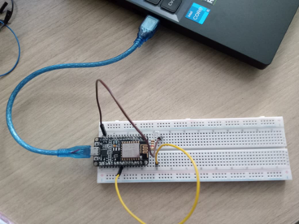
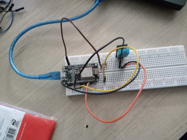

# Modul 4 - Komunikasi dan Pertukaran Data

## Penjelasan Code

### Percobaan 4A - Subscribe dan Deserialisasi Data JSON

Program Percobaan 4A digunakan untuk membuat ESP8266 menerima perintah melalui MQTT. ESP8266 melakukan subscribe pada topic perintah, kemudian menerima pesan dalam format JSON dan melakukan deserialisasi untuk mengambil nilai `perintah`.

Program menggunakan callback function yang akan dipanggil secara otomatis ketika terdapat pesan baru pada topic yang di-subscribe. Nilai `ON` digunakan untuk menyalakan LED, sedangkan nilai `OFF` digunakan untuk mematikan LED.

Program Percobaan 4A dapat disimpan dengan nama `modul4_subscribe_json`.

### Percobaan 4B - Pertukaran Data Dua Arah

Program Percobaan 4B menggabungkan proses publish dan subscribe dalam satu sistem. ESP8266 mempublikasikan data suhu dari sensor DHT11 secara berkala ke `topicData`, sekaligus menerima perintah kendali LED melalui `topicPerintah`.

Pengiriman data sensor dilakukan secara non-blocking menggunakan `millis()`. Dengan cara tersebut, proses `client.loop()` tetap dapat berjalan sehingga ESP8266 dapat menerima perintah MQTT tanpa harus menunggu proses publish selesai. Konsep ini digunakan untuk membangun komunikasi full duplex pada sistem IoT.

---

## Penjelasan Setiap Fungsi

- `setup()` dijalankan satu kali ketika ESP8266 dinyalakan. Fungsi ini memulai Serial Monitor, mengatur pin LED, menginisialisasi sensor DHT11, menghubungkan WiFi, mengatur server MQTT, dan mendaftarkan callback.
- `loop()` berjalan terus-menerus untuk menjaga koneksi MQTT, memproses pesan masuk, dan pada Percobaan 4B mengirim data sensor secara berkala.
- `WiFi.begin(ssid, password)` digunakan untuk menghubungkan ESP8266 ke jaringan WiFi.
- `WiFi.status()` digunakan untuk memeriksa status koneksi WiFi.
- `client.setServer(mqttServer, mqttPort)` menentukan alamat broker dan port MQTT yang digunakan.
- `client.setCallback(callback)` mendaftarkan fungsi `callback()` sebagai fungsi yang akan dijalankan ketika pesan MQTT diterima.
- `client.subscribe(topicPerintah)` mendaftarkan ESP8266 untuk menerima pesan dari topic perintah tertentu.
- `client.connected()` digunakan untuk memeriksa apakah ESP8266 masih terhubung dengan broker MQTT.
- `client.connect(clientId.c_str())` digunakan untuk membuat koneksi ESP8266 dengan broker MQTT.
- `client.loop()` memproses komunikasi MQTT dan harus dipanggil secara berkala agar pesan yang masuk dapat diterima.
- `callback(char* topic, byte* payload, unsigned int length)` dipanggil secara otomatis ketika pesan baru diterima pada topic yang di-subscribe.
- `deserializeJson(doc, pesan)` mengubah teks JSON yang diterima menjadi objek JSON yang dapat diakses melalui key tertentu.
- `doc["perintah"]` digunakan untuk mengambil nilai dari key `perintah` pada data JSON.
- `digitalWrite(ledPin, HIGH)` menyalakan LED.
- `digitalWrite(ledPin, LOW)` mematikan LED.
- `millis()` membaca waktu sejak ESP8266 dinyalakan dan digunakan untuk menentukan interval publish tanpa menghentikan program.
- `dht.readTemperature()` membaca nilai suhu dari sensor DHT11.
- `serializeJson(doc, buffer)` mengubah objek JSON menjadi teks yang siap dikirim melalui MQTT.
- `client.publish(topicData, buffer)` mengirim data JSON sensor ke topic data.

---

## Penjelasan Percabangan atau Conditional

Pada Percobaan 4A, kondisi `if (!client.connected())` digunakan untuk memeriksa koneksi MQTT. Jika ESP8266 tidak terhubung ke broker, program memanggil `hubungkanMQTT()` untuk mencoba membuat koneksi kembali. Setelah koneksi berhasil, ESP8266 melakukan subscribe ke topic perintah.

Di dalam fungsi `callback()`, kondisi `if (error)` digunakan untuk memeriksa apakah proses deserialisasi JSON berhasil. Jika terjadi kesalahan, program menampilkan pesan kesalahan dan menghentikan pemrosesan pesan tersebut.

Selanjutnya, program menggunakan kondisi `if (String(perintah) == "ON")` untuk menyalakan LED. Jika perintah bukan `ON`, program memeriksa kondisi `else if (String(perintah) == "OFF")` untuk mematikan LED.

Pada Percobaan 4B, kondisi `if (millis() - waktuTerakhirPublish > intervalPublish)` digunakan untuk menentukan kapan data sensor harus dipublikasikan. Jika selisih waktu sudah melebihi interval yang ditentukan, ESP8266 membaca suhu dan mengirimkannya ke topic data.

---

## Library atau Dependencies yang Diperlukan

- Arduino IDE
- Board package ESP8266 untuk Arduino IDE
- Board ESP8266 DevKit
- Library `WiFi.h`
- Library `PubSubClient.h`
- Library `ArduinoJson.h`
- Library `DHT.h`
- Sensor DHT11
- LED dan resistor 220 Ohm
- Breadboard dan kabel jumper
- Kabel USB
- Jaringan WiFi yang terhubung ke internet
- Broker MQTT publik `broker.hivemq.com`
- MQTT Explorer atau HiveMQ WebSocket Client

Library `PubSubClient` digunakan untuk komunikasi MQTT, sedangkan `ArduinoJson` digunakan untuk membuat dan membaca data dalam format JSON. Library DHT digunakan untuk membaca data suhu dari sensor DHT11.

---

## Jawaban Pertanyaan Praktikum yang Berkaitan dengan Code

### Percobaan 4A

#### 1. Diagram Alur

Berikut diagram alur proses penerimaan dan pemrosesan pesan pada fungsi callback:


Program menerima pesan MQTT melalui callback, kemudian mengubah payload menjadi String. Pesan tersebut diproses menggunakan `deserializeJson()`. Jika JSON valid, nilai `perintah` dibaca dan digunakan untuk menentukan apakah LED dinyalakan atau dimatikan.

#### 2. Apa yang akan terjadi apabila pesan yang dipublikasikan bukan merupakan format JSON yang valid?

Jika pesan yang diterima bukan JSON yang valid, proses `deserializeJson()` akan menghasilkan error. Kondisi `if (error)` akan bernilai benar sehingga program menampilkan pesan kegagalan parsing pada Serial Monitor dan menjalankan `return`. Dengan demikian, pesan tersebut tidak diproses sebagai perintah untuk mengendalikan LED.

#### 3. Mengapa fungsi `client.subscribe()` dipanggil di dalam fungsi `hubungkanMQTT()`, bukan di dalam `setup()`?

`client.subscribe()` diletakkan di dalam `hubungkanMQTT()` karena subscribe perlu dilakukan setelah ESP8266 berhasil terhubung ke broker MQTT. Jika koneksi MQTT terputus dan program melakukan koneksi kembali, fungsi tersebut akan dijalankan lagi sehingga ESP8266 dapat melakukan subscribe kembali pada topic perintah.

#### 4. Modifikasi Program dengan Nilai Intensitas LED

Bagian berikut adalah modifikasi untuk Percobaan 4A agar ESP8266 dapat mengatur intensitas kecerahan LED menggunakan nilai intensitas yang dikirim melalui JSON. Program menggunakan fungsi analogWrite() untuk mengatur nilai PWM pada LED.

```json
{"perintah":"ON","intensitas":200}
```

Bagian program yang menangani data tersebut dapat dibuat seperti berikut:

```cpp
#include <ESP8266WiFi.h>
#include <PubSubClient.h>
#include <ArduinoJson.h>

const char* ssid = "myminetae";
const char* password = "0987654321";
const char* mqttServer = "broker.hivemq.com";
const int mqttPort = 1883;
const char* topicPerintah = "unsoed/tk245004/kelompok2425/perintah";
const int ledPin = D5;

WiFiClient espClient;
PubSubClient client(espClient);

void callback(char* topic, byte* payload, unsigned int length) {
  String pesan;
  for (unsigned int i = 0; i < length; i++) {
    pesan += (char)payload[i];
  }

  Serial.print("Pesan diterima [");
  Serial.print(topic);
  Serial.print("]: ");
  Serial.println(pesan);

  JsonDocument doc;
  DeserializationError error = deserializeJson(doc, pesan);
  if (error) {
    Serial.print("Gagal parsing JSON: ");
    Serial.println(error.c_str());
    return;
  }

  const char* perintah = doc["perintah"];

  int intensitas = doc["intensitas"] | 0;
  // Mengambil nilai intensitas dari JSON.
  // Jika nilai intensitas tidak tersedia, digunakan nilai 0.

  if (String(perintah) == "ON") {
    analogWrite(ledPin, intensitas);
    // Mengatur kecerahan LED menggunakan PWM sesuai nilai intensitas.

    Serial.print("Aktuator: ON, Intensitas: ");
    Serial.println(intensitas);
    // Menampilkan nilai intensitas LED pada Serial Monitor.

  } else if (String(perintah) == "OFF") {
    analogWrite(ledPin, 0);
    // Mengatur nilai PWM menjadi 0 sehingga LED mati.

    Serial.println("Aktuator: OFF");
  }
}

void hubungkanWiFi() {
  WiFi.begin(ssid, password);
  Serial.print("Menghubungkan ke WiFi");

  while (WiFi.status() != WL_CONNECTED) {
    delay(500);
    Serial.print(".");
  }

  Serial.println("\nWiFi berhasil terhubung!");
}

void hubungkanMQTT() {
  while (!client.connected()) {
    Serial.print("Menghubungkan ke broker MQTT...");

    String clientId = "ESP8266Client-" + String(random(0xffff), HEX);

    if (client.connect(clientId.c_str())) {
      Serial.println("berhasil terhubung!");

      client.subscribe(topicPerintah);

      Serial.print("Subscribe ke topic: ");
      Serial.println(topicPerintah);
    } else {
      Serial.print("gagal, rc=");
      Serial.print(client.state());
      Serial.println(" coba lagi dalam 2 detik");

      delay(2000);
    }
  }
}

void setup() {
  Serial.begin(115200);

  pinMode(ledPin, OUTPUT);

  analogWrite(ledPin, 0);
  // Memberikan nilai PWM awal 0 agar LED dalam kondisi mati.

  hubungkanWiFi();

  client.setServer(mqttServer, mqttPort);
  client.setCallback(callback);
}

void loop() {
  if (!client.connected()) {
    hubungkanMQTT();
  }

  client.loop();
}
```
---

### Percobaan 4B

#### 1. Mengapa penggunaan `delay()` yang lama sebaiknya dihindari pada program yang menggabungkan proses publish dan subscribe secara bersamaan?

`delay()` bersifat blocking sehingga selama waktu penundaan berlangsung, program tidak dapat menjalankan proses lain secara normal. Jika `delay()` digunakan terlalu lama, pemanggilan `client.loop()` juga ikut tertunda sehingga pesan MQTT yang masuk dapat terlambat diproses.

Pada sistem yang membutuhkan komunikasi dua arah secara real-time, kondisi tersebut dapat membuat respons aktuator menjadi lambat. Oleh karena itu, proses publish pada Percobaan 4B menggunakan `millis()` agar proses subscribe tetap dapat berjalan.

#### 2. Jelaskan cara kerja mekanisme non-blocking menggunakan fungsi `millis()` pada program!

Program menyimpan waktu terakhir data dipublikasikan pada variabel `waktuTerakhirPublish`. Selanjutnya, program menghitung selisih antara waktu sekarang yang diperoleh dari `millis()` dengan waktu terakhir publish.

Jika selisih tersebut lebih besar daripada `intervalPublish`, program membaca suhu dari DHT11 dan mengirimkan data ke broker MQTT. Setelah proses tersebut selesai, `waktuTerakhirPublish` diperbarui dengan nilai `millis()` terbaru. Selama menunggu interval berikutnya, `client.loop()` tetap dipanggil sehingga ESP8266 tetap dapat menerima pesan dari broker.

#### 3. Apa yang akan terjadi apabila fungsi `client.loop()` jarang dipanggil?

Jika `client.loop()` jarang dipanggil, ESP8266 akan lebih lambat memproses pesan MQTT yang masuk. Koneksi dengan broker juga dapat terganggu karena fungsi tersebut digunakan untuk menangani komunikasi MQTT dan menjaga koneksi tetap aktif.

Pada sistem kendali, kondisi ini menyebabkan perintah `ON` atau `OFF` tidak langsung diproses sehingga respons LED menjadi terlambat.

#### 4. Modifikasi Program untuk Mengendalikan Aktuator Kedua

Program dapat ditambahkan topic perintah kedua, misalnya untuk mengendalikan buzzer:

```cpp
#include <ESP8266WiFi.h>
#include <PubSubClient.h>
#include <ArduinoJson.h>
#include <DHT.h>

const char* ssid = "NAMA_WIFI_ANDA";
const char* password = "PASSWORD_WIFI_ANDA";

const char* mqttServer = "broker.hivemq.com";
const int mqttPort = 1883;
const char* topicData = "unsoed/tk245004/kelompokAnda/data";
const char* topicPerintah = "unsoed/tk245004/kelompokAnda/perintah";
const char* topicBuzzer = "unsoed/tk245004/kelompokAnda/buzzer";
// Membuat topic MQTT baru khusus untuk mengendalikan buzzer.

#define DHTPIN 4
#define DHTTYPE DHT11
const int ledPin = 2;
const int buzzerPin = 5;
// Menentukan pin ESP8266 yang digunakan untuk buzzer.

DHT dht(DHTPIN, DHTTYPE);
WiFiClient espClient;
PubSubClient client(espClient);

unsigned long waktuTerakhirPublish = 0;
const long intervalPublish = 5000;

void callback(char* topic, byte* payload, unsigned int length) {
  String pesan;
  for (unsigned int i = 0; i < length; i++) pesan += (char)payload[i];

  JsonDocument doc;
  if (deserializeJson(doc, pesan)) return;

  const char* perintah = doc["perintah"];

  if (String(topic) == topicPerintah) {
    digitalWrite(ledPin, String(perintah) == "ON" ? HIGH : LOW);
    Serial.print("Perintah diterima -> Aktuator LED: ");
    Serial.println(perintah);
  } 
  else if (String(topic) == topicBuzzer) {
    // Mengecek apakah pesan berasal dari topic buzzer.
    // Jika benar, perintah digunakan untuk mengendalikan buzzer.

    digitalWrite(buzzerPin, String(perintah) == "ON" ? HIGH : LOW);
    // Menyalakan buzzer jika perintah ON dan mematikannya jika OFF.

    Serial.print("Perintah diterima -> Aktuator Buzzer: ");
    Serial.println(perintah);
    // Menampilkan status buzzer pada Serial Monitor.
  }
}

void hubungkanWiFi() {
  WiFi.begin(ssid, password);
  while (WiFi.status() != WL_CONNECTED) delay(500);
  Serial.println("WiFi berhasil terhubung!");
}

void hubungkanMQTT() {
  while (!client.connected()) {
    String clientId = "ESP8266Client-" + String(random(0xffff), HEX);

    if (client.connect(clientId.c_str())) {
      client.subscribe(topicPerintah);

      client.subscribe(topicBuzzer);
      // Melakukan subscribe ke topic buzzer agar ESP8266 dapat menerima perintah buzzer.

      Serial.println("Terhubung dan subscribe topic perintah");
      Serial.println("Subscribe topic buzzer");
    } else {
      delay(2000);
    }
  }
}

void setup() {
  Serial.begin(115200);
  pinMode(ledPin, OUTPUT);

  pinMode(buzzerPin, OUTPUT);
  // Mengatur pin buzzer sebagai output.

  digitalWrite(ledPin, LOW);

  digitalWrite(buzzerPin, LOW);
  // Memastikan buzzer dalam kondisi mati saat ESP8266 pertama dijalankan.

  dht.begin();
  hubungkanWiFi();

  client.setServer(mqttServer, mqttPort);
  client.setCallback(callback);
}

void loop() {
  if (!client.connected()) hubungkanMQTT();

  client.loop();

  if (millis() - waktuTerakhirPublish > intervalPublish) {
    waktuTerakhirPublish = millis();

    float suhu = dht.readTemperature();

    if (!isnan(suhu)) {
      JsonDocument doc;
      doc["suhu"] = suhu;

      char buffer[128];
      serializeJson(doc, buffer);

      client.publish(topicData, buffer);

      Serial.print("Data terkirim: ");
      Serial.println(buffer);
    }
  }
}

---

## Penjelasan Singkat Detail Percobaan

Pada Percobaan 4A, ESP8266 melakukan subscribe pada topic MQTT dan menerima pesan JSON yang berisi perintah untuk mengendalikan LED. Pesan yang diterima diproses melalui fungsi callback, kemudian dilakukan deserialisasi menggunakan `deserializeJson()`. Jika perintah yang diterima adalah `ON`, LED dinyalakan, sedangkan jika perintah `OFF`, LED dimatikan.

Pada Percobaan 4B, ESP8266 menjalankan komunikasi dua arah dengan mempublikasikan data suhu dan menerima perintah kendali LED secara bersamaan. Data suhu dikirim setiap 5 detik menggunakan mekanisme non-blocking berbasis `millis()`, sementara `client.loop()` tetap dipanggil untuk memproses pesan masuk.

---

## Skematik atau Diagram Rangkaian

### Percobaan 4A



Rangkaian Percobaan 4A menggunakan ESP8266, LED, resistor 220 Ohm, breadboard, dan kabel jumper. LED digunakan sebagai simulasi aktuator yang dikendalikan melalui perintah MQTT.

### Percobaan 4B



Pada Percobaan 4B, rangkaian menggunakan ESP8266, sensor DHT11, dan LED. Sensor DHT11 digunakan untuk membaca suhu yang kemudian dipublikasikan melalui MQTT, sedangkan LED digunakan sebagai aktuator yang menerima perintah dari topic MQTT.

---

## Foto Proses Praktikum atau Perangkaian

### Percobaan 4A - Subscribe dan Kendali LED


Serial Monitor menampilkan pesan JSON yang diterima dari topic MQTT serta status LED setelah perintah diproses oleh ESP8266.


MQTT Explorer digunakan untuk mengirim perintah melalui topic MQTT yang kemudian diterima oleh ESP8266 untuk mengendalikan LED.

### Percobaan 4B - Pertukaran Data Dua Arah


Serial Monitor menampilkan data suhu yang dikirim oleh ESP8266 serta pesan perintah yang diterima dari broker MQTT.
MQTT Explorer menampilkan data suhu yang dikirim ESP8266 dan digunakan untuk mengirim perintah melalui topic MQTT, sehingga proses pertukaran data dua arah dapat diamati.

